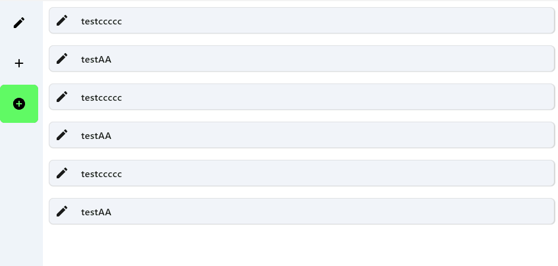

> **Effect**
<table>
	<tr>
		<td align="center"></td>
	</tr>
</table>

> **Example**
```kotlin
NavigationRail {
    items.fastForEachIndexed { index, item ->
        RippleRoundedFillBox(
            modifierAfter = Modifier.padding(20.dp),
            selected = index == barSelectedItem,
            isSelectEnable = true,
            innerColor = Color.Gray.copy(alpha = 0.6f),
            outlineColor = Color.Green.copy(alpha = 0.6f),
            onClick = { barSelectedItem = index }

        ) {
            Icon(imageVector = item, contentDescription = null, tint = Color.Black)
        }
        /*NavigationRailItem(
            selected = index == barSelectedItem,
            onClick = { barSelectedItem = index },
            icon = { }
        )*/
    }
}
```

```kotlin
@Composable
@Preview
fun RippleBoxExample() {
    val items = listOf(1,2,3)
    LazyColumn(modifier = Modifier.fillMaxSize()) {
        items(items.size) {
            RippleRoundedOutlineBox(
                modifierBefore = Modifier.padding(10.dp),
                modifierAfter = Modifier
                    .fillMaxSize()
                    .border(1.dp, Color.LightGray.copy(alpha = 0.5f), RoundedCornerShape(7.5.dp))
                    .shadow(1.dp, RoundedCornerShape(7.5.dp)),
                outlineWidth = 2f,
                onClick = { },
            ) {
                Row {
                    Icon(
                        imageVector = Icons.Rounded.Create,
                        contentDescription = null,
                        modifier = Modifier.padding(10.dp)
                    )
                    Text(
                        text = items[it].toString(),
                        style = MaterialTheme.typography.bodyLarge.copy(fontWeight = FontWeight.Medium),
                        modifier = Modifier.padding(10.dp)

                    )
                }
            }
        }
    }
}
```